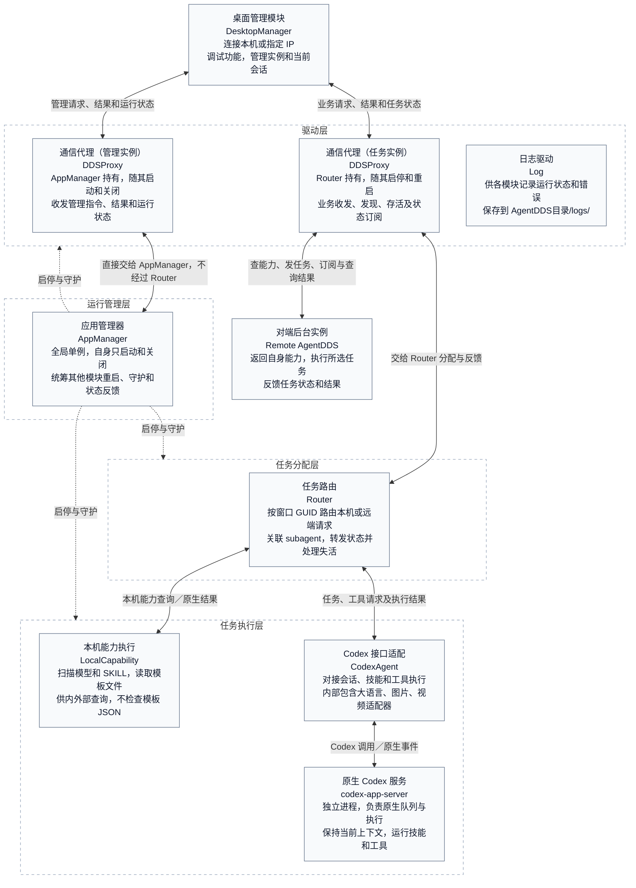
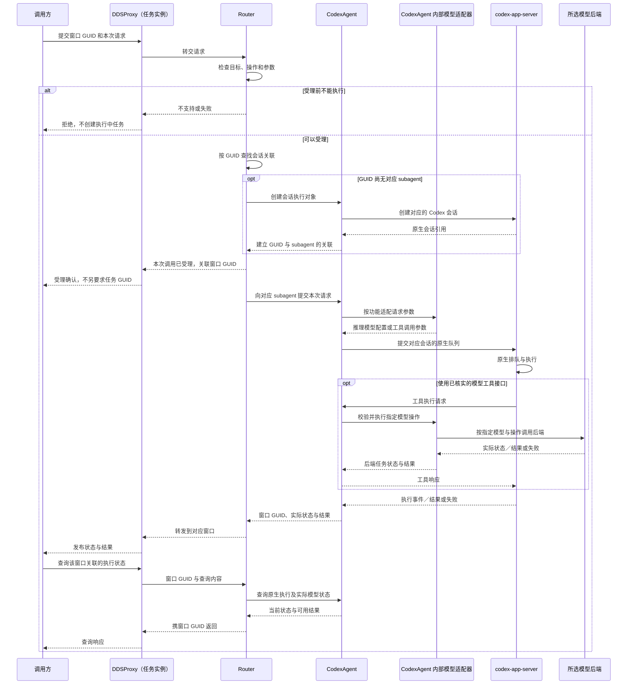

# AgentDDS 技术方案设计文档

> 状态：四层架构、两个后台进程及 DDSProxy 实例归属已确认。AppManager 自身只启动和关闭，其管理 DDSProxy 不随其他模块重启；Router 重启时连同自己的任务 DDSProxy 重新初始化。恢复失败等待 10 秒再试。
> 本轮已确认：GUID 标识会话窗口及对应 subagent，同一窗口多次请求沿用它；按 GUID 复用或创建会话，排队交给 Codex，不再拆出调用方逐次提供的任务 GUID。
>
> 产品依据：`specs/REQ-001-产品需求文档.md` 及用户后续确认。架构覆盖结论见 §5.2；有模块承接不等于实现已验证，本文不是全部验收通过的声明。

## 1. 软件需求与技术约束

这里的“受理”指目标确认接下任务，不代表任务已经成功。

- **产品边界**：AgentDDS 是设备程序使用的后台服务，不开发设备业务。同机只提供一个实例，桌面程序独立运行。
- **本机启停**：启动和整体关闭只在本机操作。整体关闭包括 AppManager 和任务侧退出，两个 DDSProxy 实例都关闭，桌面程序继续独立运行。
- **本机／远程重启**：由 AppManager 重启其他模块，保留自身和管理 DDSProxy；Router 重启时重新初始化自己的任务 DDSProxy。远程不能借重启启动已停止的实例；收到重启请求不等于重启成功。
- **当前对话**：codex-app-server 保持当前上下文；Router 保存窗口 GUID 与 subagent 的关联，CodexAgent 对接创建、原生排队和执行。调用方不必逐轮重发完整历史，长期记录由调用方保存。
- **窗口 GUID**：请求方生成并提供，标识会话窗口（或逻辑会话）及其 subagent，不是单次任务编号。同一窗口的多次请求沿用 GUID，不另要求每次生成一个任务 GUID。
- **会话创建**：需要 Codex 执行的请求，按 GUID 查找；存在则复用 subagent，不存在则创建并关联该 GUID。不需要额外的新建标识或创建请求；本机能力查询等原生调用不必创建 subagent。
- **会话清理**：主动结束立即关闭对应会话、子任务并删除记录；观察到存活标记消失后等待一分钟，期间恢复则保留，否则执行相同清理。不要求调用方定时发心跳，不按聊天闲置时间计时，不影响其他请求方。
- **模型反馈**：三类模型先确认受理，再订阅或查询真实状态和结果，反馈携带窗口 GUID。各次调用仍要区分已受理、处理中、成功和失败；具体原生回执关联待对接确认，不把 GUID 当作单次任务编号。
- **重启失效**：旧会话和旧任务不再有效，不恢复记录、不自动重发。
- **自动查找**：指定目标优先；开关默认关闭，仅本机宿主或同机桌面可改，不经 Zenoh 开放修改，也不逐次传入。开启后，仅在未指定目标或指定目标未能受理时自动查找。命中首个匹配目标后先订阅再申请；受理后失败不改选、不重做。
- **公开能力**：每项对外功能有独立 SKILL 和参数模板。“本机能力查询”和“局域网能力查找”是两个技能，只公布实际支持的能力。
- **访问范围**：第一版局域网普通调用和远程管理均无认证授权，包括远程重启；远程不开放启动、关闭或本机开关修改。
- **通信与容量**：支持多个 Zenoh 中转站，不承诺故障自动切换。并发、超时、结果保留时间和容量上限尚未确定。

## 2. 技术选择与资源位置

**技术选择：**

| 项目 | 已确定内容 | 仍需确认或验证 |
| --- | --- | --- |
| 语言与系统 | Rust；Linux、Windows、macOS | 工具链版本 |
| 后台进程 | 只有 AgentDDS、codex-app-server 两个进程；不另设管理进程或任务进程 | AgentDDS 进程内的线程／任务安排 |
| 桌面程序 | 独立、非网页；默认本机，可输入远端 IP | GUI 工具包、默认安装目录和打包方式 |
| Codex | 计划以 Git submodule 引入，经本机 codex-app-server 接入；不固定内部 subagent 数量和调度 | 尚未集成；需固定提交、构建方式及该版本的具体接口 |
| DDSProxy | 统一的 Zenoh 通信类；AppManager、Router 各持有一个独立实例，实例的启停和重启跟随所属模块。外部 JSON 不照搬后端协议 | 客户端版本、两实例的通信配置、按 IP 连接的端点、多中转站配置 |
| 三类模型 | 大语言、图片、视频适配器均在 CodexAgent 内部；视频以 MiniMax H3 兼容为目标，只实现实际后端已核实的操作 | 后端版本、推理／工具调用接口及 H3 操作清单，当前不能称为已兼容 |
| 数据与排队 | Codex 保存当前上下文并处理原生队列；Router 按窗口 GUID 路由，不另建执行队列或逐次业务 GUID 表 | 固定版本的 subagent／thread 映射、原生回执与模型状态关联、队列清理及持久化边界 |
| Log | 统一记录运行状态和错误，保存到 `<AgentDDS目录>/logs/`；不记录聊天正文、完整提示词／回复或密钥 | 日志格式、级别和清理方式 |

**资源位置：**

```text
bin/
  skills/<技能名称>/
    SKILL.md
    template.json
  models/<模型名称>/
    <实际模型文件…>
    template.json
```

- 每个技能、每个模型只用一个 `template.json`，在同一文件中放参数结构、说明和填写示例，不再拆文件。
- 需要 Agent 填参时，根据模板返回调用参数 JSON；实际请求由 Router／执行端按调用规则处理，不由 LocalCapability 检查模板。填参不覆盖原模板，也不代表执行成功；原生查询不因此强制调用 Codex。
- 模型文件不限定格式；目录或文件存在不代表后端已经可调用。
- Codex 如何发现并加载 `bin/skills`，需按固定版本验证。
- Log 的输出目录为 `<AgentDDS目录>/logs/`，不是聊天历史目录；本轮只说明位置，不创建实际日志文件。
- 测试配置取自本地 `test/model_config`，其中可能有凭据，不写入文档、不提交。真实模型验证范围见 §5。

## 3. 软件架构

### 3.1 进程、分层和依赖

采用四层结构：**运行管理层、任务分配层、任务执行层、驱动层**。层表示职责，不表示进程。后台只有两个进程：

| 进程 | 包含内容 |
| --- | --- |
| AgentDDS | AppManager、Router、LocalCapability、CodexAgent、两个 DDSProxy 实例、Log |
| codex-app-server | 原生 Codex 服务；由 AppManager 启停和守护，CodexAgent 对接执行接口 |

桌面程序是独立客户端，不计入这两个后台进程，也不属于后台内部层。

本文统一称谓：产品需求中的“启动端”由 AppManager 及管理实例承担；“工作端”统一称为**任务侧**，包括 Router、LocalCapability、CodexAgent、codex-app-server 和 DDSProxy 任务实例。任务侧跨上述两个进程，不是第三个进程；Log 位于 AgentDDS 进程内。

**统一重启范围**：Router、LocalCapability、CodexAgent、codex-app-server、Log；任务 DDSProxy 随 Router 重启，不单独重启。AppManager 及其管理 DDSProxy 保持运行。桌面、远端 AgentDDS 和外部模型服务不在此范围内。

**读图方式：**实线方块写模块的中文名、英文名和功能；DDSProxy 的两个方块表示同一个类的两个实例，不是两个通信类。虚线外框表示层，实线箭头表示请求／结果，虚线箭头表示启停和守护范围。Log 供本项目各模块使用，省略重复的日志连线。



图外的设备程序与其他调用方也使用同一套 DDSProxy 接口；对端 AgentDDS 不是本机模块。

**处理路径：**

- **管理指令**：`DDSProxy（管理实例）↔ AppManager`。AppManager 直接接收指令、协调各模块并反馈结果，不经过 Router。
- **本机能力查询**：`DDSProxy（任务实例）→ Router → LocalCapability`，结果沿原路返回。不经过 CodexAgent 或 codex-app-server，不创建 Codex subagent。
- **需要 Codex 的业务任务**：`DDSProxy（任务实例）→ Router → CodexAgent → codex-app-server`，执行结果回到 Router，再由任务实例发出。
- **调用远端能力**：`Router ↔ DDSProxy（任务实例）↔ 对端 AgentDDS`。查找技能只返回目标；原任务由 Router 申请并接收状态，不由 AppManager 调度。

**边界：**

- AppManager 负责整体运行。管理消息不依赖 Router；AppManager 仍负责启停和守护 Router，这不是管理请求的转发路径。守护检测不能依赖被守护模块正常工作。
- AppManager 与 Router 位于同一 AgentDDS 进程，依靠进程内独立执行安排避免业务阻塞管理。若整个 AgentDDS 进程崩溃，AppManager 也会退出，不能由它自行恢复；不因此新增第三个守护进程。
- DDSProxy 只定义一个类。AppManager、Router 各持有一个实例，各自管理连接、订阅和回调，不共用通信开关或连接状态。实例的初始化、关闭和重启由所属模块负责，不作为独立模块重启。实现时不能只复制同一 Zenoh Session 的引用来冒充独立连接，依据见 §5.3 [Z1]。
- AppManager 正常运行期间不重启自身，因此也不重启管理 DDSProxy；Router 重启时关闭并重新初始化自己的任务 DDSProxy。两实例的通信独立，但共用网络故障仍可能同时影响它们。
- 两实例按管理／任务分工，不按本机／远程划分。§1 的本机启停限制不变；整个程序未运行时，仍由本机启动程序。消息地址或 JSON 自报“本机”不等于来源可信，本机专属操作的接入限制仍需落实。
- LocalCapability 是任务执行层的原生能力，不是任务分配层的数据仓库。它负责扫描、整理并返回本机模型与技能能力，Router 直接调用。
- SKILL 是功能说明和调用约定，不另算架构模块。有 SKILL 描述不代表必须经过 Codex，也不扩大本机专属操作的访问范围。两项查询／查找技能的分工见 §3.3。
- 三类模型适配器仍在 CodexAgent 内部。按实际后端说明实现已核实支持的全部操作，不猜造功能，也不只挑常见操作。Codex 推理模型配置与模型工具参数分开，不假定只改 `model` 字段便支持任意后端。
- Log 只记录运行和错误信息，不保存聊天正文、完整提示词／回复或密钥。Codex 自身记录也要纳入会话清理，不能只关闭 Log 就宣称不留历史。

### 3.2 层职责与模块边界

| 层 | 模块 | 职责与依赖 |
| --- | --- | --- |
| 运行管理层 | 应用管理器 `AppManager` | 全局单例；自身只启动和关闭，通过自己持有的 DDSProxy 收发管理消息，不经 Router；负责其他模块启停、重启和守护。 |
| 任务分配层 | 任务路由 `Router` | 持有任务 DDSProxy，随自身启停、重启管理该实例；校验并按窗口 GUID 路由请求。保存会话关联，转发状态、查询和结束请求，处理失活；不另建执行队列，不转发运行管理指令。 |
| 任务执行层 | 本机能力执行 `LocalCapability` | 启动时扫描本机模型和 SKILL，查询时读取所需目录和文件，供内外部查询；不缓存模板、不监听目录、不检查模板 JSON，不调用 Codex 或汇总其他主机。 |
| 任务执行层 | Codex 接口适配 `CodexAgent` | 按 Router 指令创建／复用会话，接入 Codex 原生队列、执行事件和清理；内部含三类模型适配器，关联原生回执与实际模型状态并回报。 |
| 任务执行层 | 原生 Codex 服务 `codex-app-server` | 提供原生队列、执行、当前上下文、技能与工具能力；对象类型、排队与清理接口按固定版本验证，不把队列持久化当成项目的历史恢复功能。 |
| 驱动层 | 通信代理 `DDSProxy` | 统一封装 Zenoh 收发、发现、发布／订阅、查询和存活事件；两个实例分别属于 AppManager、Router，生命周期跟随所属模块；不选择目标、不判断业务结果。 |
| 驱动层 | 日志 `Log` | 为各模块写入运行和错误日志，目录为 `<AgentDDS目录>/logs/`；不记录聊天正文或密钥。 |

DesktopManager 是独立客户端。模型文件、SKILL.md 和 template.json 是模块使用的资源，不额外划成一层或重复的执行模块。

**AppManager 守护范围（已确认）：**

- **DDSProxy 管理实例、任务实例**：监测通信状态，分别随 AppManager、Router 启停；不单独重启实例。
- **Router**：任务分配模块的启动、停止和运行状态。
- **LocalCapability**：本机能力扫描、初始化是否完成或失败。
- **CodexAgent**：Codex 对接模块的初始化、关闭和运行状态。
- **codex-app-server**：Codex 服务的启动、退出和异常状态。
- **Log**：日志初始化、写入异常和关闭清理。

守护不等于每个类都加心跳：普通类检查初始化和调用错误，独立运行的服务检查存活。统一重启范围内的模块本身失效时，共用 §4.2.2 的恢复流程；任务 DDSProxy 故障归入 Router 处理。普通业务失败不触发重启，具体检测方式仍待确认。

AppManager 的管理 DDSProxy 不纳入其他模块重启；其通信故障怎样恢复连接，留待 DDSProxy 章节确认，不因此重启 AppManager 或管理实例。

AppManager 管模块运行，不直接管理每个任务或 subagent，后者由 Router、CodexAgent 配合管理；桌面程序、远端 AgentDDS 和外部模型服务不在守护范围内。

### 3.3 运行流程与错误处理

**启动与能力查询：**

1. 本机运行 AgentDDS，AppManager 初始化自身及其管理 DDSProxy，再启动 Log 和其他模块；Router 初始化自己的任务 DDSProxy，LocalCapability 扫描模型、技能和模板。管理连接建立不代表已能接业务。
2. 所需模块准备好后，AppManager 发布带本次启动编号的就绪通知；任务实例承担业务发现和查询，调用方能识别同一 AgentDDS 的两个入口。具体地址和字段待确定。
3. 本机能力查询 SKILL 经 Router 直接调用 LocalCapability。返回本实例模型、类型、已核实操作，以及每项技能用途和模板；单独查询模型使用同一份清单。
4. LocalCapability 启动时扫描，查询时直接读取所需资料；不缓存模板、不监听目录、不增加刷新接口、不检查模板 JSON。文件无法读取时如实反馈，不伪造模板；模型元信息的来源仍见 §5.1，不凭文件存在判断后端可用。

**本机 Agent／模型执行：**

1. Router 解析业务 JSON，检查目标、操作和参数；需要 Codex 的任务交给 CodexAgent。本机原生查询不创建 Codex subagent。
2. Router 按窗口 GUID 找到或通过 CodexAgent 创建对应 subagent，交给 Codex 的原生队列处理本次输入。三类模型先确认受理，反馈关联原窗口 GUID，不要求调用方逐次生成任务 GUID。
3. CodexAgent 关联原生执行事件与模型实际状态，Router 经自己的 DDSProxy 转回对应窗口。状态订阅和查询依据同一执行来源；GUID 只定位窗口，单次调用的回执关联不在这里另造一套编号。
4. 图片、视频模型只处理本次调用参数，不维护模型聊天历史；窗口 GUID 用于路由，不改变媒体输入边界。不能把 Codex 文字回答或轮次结束直接当成模型任务完成。

**会话与请求方存活：**

- Router 用窗口 GUID 关联请求方、存活标记和 subagent。同一 GUID 的多次输入属于同一窗口，不是重复任务，不能仅因此拒绝。外部 GUID 不要求等于 Codex 原生标识，具体对象映射仍待验证。
- 需要 Codex 执行的调用到达实际执行实例后，Router 查询 GUID：已存在则调用对应 subagent；不存在则经 CodexAgent 创建并保存关联。转发保留原 GUID，由对端按相同规则处理。
- DDSProxy 任务实例订阅请求方的存活标记，将出现／消失事件交给 Router，接口依据见 §5.3 [Z2]。消失后由 Router 计时一分钟，恢复则取消清理；到期仍未恢复则通知 CodexAgent 关闭对应会话、子任务并删除记录。
- 请求方或桌面主动结束会话时走同一清理路径，不等一分钟；会话的待处理请求一并清理，不在关闭后继续执行。会话查询只返回当前连接与执行状态，不开放长期聊天历史。
- 关闭执行、退订事件、删除记录是不同动作，不能互相替代。需按固定 Codex 版本验证普通结束、子任务清理及异常退出后的残留处理，依据见 §5.3 [O1]。

**局域网查找与调用：**

1. Router 按 §1 的指定目标和本机开关规则决定是否调用“局域网能力查找”SKILL，不由 DDSProxy 或 AppManager 选择目标。
2. 查找技能逐个读取可访问实例的“本机能力查询”结果，首个匹配即返回，找不到则失败。需要的网络查询经 Router、DDSProxy 任务实例完成；技能与这些接口的工具连接方式待固定 Codex 版本验证。
3. Router 取得目标后，先订阅对端状态，再申请原业务调用；对端只执行自身能力，不递归查找。请求和反馈保留窗口 GUID，用于回到对应窗口，不维护长期全局能力清单。
4. 跨实例仍按原请求方的存活和结束要求清理会话；原请求方与存活标记怎样传递、关联，需在 JSON 标准中明确，不能用转发实例仍存活代替原请求方存活。
5. 对端受理后失败或重启，本机向上层反馈失败，不改选、不重做、不恢复旧任务。网络超时导致无法判断是否已受理时，处理契约待明确，不能把“没收到响应”当成“肯定未执行”。

**桌面管理：**

- DesktopManager 独立运行，默认本机，可输入远端 IP；管理与任务入口都对应所选实例，不混用本机和远端的数据。
- 实例控制、运行状态走管理实例；查看能力、调试 Agent／模型／技能、查看或结束当前会话走任务实例和 Router。
- 后台未运行时，本机桌面可从默认目录启动程序；非默认目录不承诺自动定位。自动查找开关按本机专属配置修改，不通过 Zenoh 开放，具体本机接口待确定。
- 本机整体关闭不退出桌面；远程不能启停。重启后按新就绪通知重新连接，未就绪不显示成功。

**失败与限制：**

- 管理通信可用不等于业务已就绪；重连也不代表发生了重启，不能因此发送新的就绪通知。Codex 异常退出的残留记录需清理，具体方式待验证。
- 管理请求不经过 Router，其他模块重启也不重建管理 DDSProxy。管理通信正常时可继续查询重启状态；若管理通信本身故障，则不能宣称仍可查询。AppManager 的恢复流程和 10 秒计时不依赖 DDSProxy 可用。
- 本机能力查询只报告已核实能力，不把文件存在或 Agent 推测当成能力可用。
- 不以 Agent 的文字回答代替模型实际结果，不猜测进度百分比。
- 没有匹配目标就失败，对端不继续代为查找；任务受理后失败不换目标、不重做。此规则也约束 Codex 工具执行：已判定失败的业务不能由 Agent 再次发起工具调用来重做。
- JSON、目标或操作不合法时，由对应的 AppManager／Router 入口明确拒绝，不伪装成执行中任务。协议字段和错误码待确认。
- 重启后旧会话、旧任务失效，重新就绪后桌面恢复连接。守护或恢复模块不等于重新提交旧业务任务。
- 目标、模型后端或中转站导致失败时如实反馈；对端重启后，发起端向上层报失败，不代为恢复。

下图是本机已选定目标后的模型调用示意，不含原生查询和跨实例查找。GUID 只识别窗口及 subagent；排队、回执和媒体工具接口仍需按固定 Codex 版本对接验证，不能把业务流程图当成原生 API 已验证的证明。



后端返回“已提交”不等于成功。媒体任务的后续查询或通知由对应适配器接入，CodexAgent 持续回报给 Router；不同调用的原生回执及结果关联不能只靠窗口 GUID 区分，具体协议待确认。

## 4. 模块架构与接口概览

逐模块确认。本章已展开 AppManager、Router、LocalCapability 的接口草案；功能与已确认规则据实保留，名称、详细签名和公共 JSON 结构仍待审阅。其他模块只留标题，不提前补写接口。SKILL 属于资源与执行能力，不与模块并列。

### 4.1 模块组织

### 4.2 运行管理层／AppManager（接口草案待复核）

#### 4.2.1 功能

管理 AgentDDS 的启动、整体关闭、其他模块重启、运行状态和模块守护；范围见 §3.2，不参与具体业务执行。

- 全局单例配合本机单例锁，防止同机重复启动服务；两个 DDSProxy 对象不等于两个 AgentDDS 服务实例。
- 管理请求通过自己的 DDSProxy 实例直接到达，不经过 Router。
- AppManager 自身只有启动和关闭；`restart()` 是它重启其他模块的方法，不会重启自身或自己的 DDSProxy。
- 管模块是否正常运行，不管理单个任务的状态、会话记录或自动查找开关。

#### 4.2.2 实现方式

**启动顺序：**

```text
本机运行 AgentDDS（桌面可从默认目录启动）
    → init() 读取配置、取得锁，初始化自身的管理 DDSProxy
    → start() 更新本次启动编号，启动 Log 和其他模块
    → Router 初始化自己的任务 DDSProxy
    → 收集各模块的准备结果
    → onReady() 确认整体可用，再发布就绪
```

- 首次运行是本机进程操作，不向尚未运行的程序发消息让它启动自己。
- AppManager 在 AgentDDS 进程内初始化和管理其他本机模块，并启动独立的 codex-app-server 进程；CodexAgent 对接该服务。进程内的线程／任务安排另定，不再拆进程。
- 管理通信和守护检测不能因 Router 阻塞而一起停住；不能只靠“两个 DDSProxy 对象”就认为已经满足独立运行。

**控制入口：**

- 运行中的实例控制统一经 DDSProxy 管理实例交给 AppManager；不另建一套 Zenoh 类，也不让 Router 转发。
- `start()`、`stop()`、`restart()` 不靠名称判断本机／远程。远端只开放运行中实例重启和运行状态查询，不开放启动或整体关闭。
- 本机专属命令的来源限制需要在接入配置与入口检查中落实，不能相信 JSON 自报来源；具体方式待确认。本机自动查找配置不属于这组 Zenoh 控制消息。

**关闭与重启：**

- 先标记关闭／重启中并停止接受新业务，立即强制结束仍在运行的 codex-app-server，不等业务完成或 Codex 正常退出；再协调 Router、CodexAgent 清理旧任务、会话记录和模块资源。
- 重启保留 AgentDDS 进程、AppManager、单例锁和管理 DDSProxy；重新初始化 Router、LocalCapability、CodexAgent、Log，并重启 codex-app-server。任务 DDSProxy 随 Router 重新初始化，所需模块全部准备好才发就绪通知。**`restart()` 不重新执行 AppManager 的 `init()`，也不能调用整体退出的 `stop()`。**
- 整体关闭时，任务侧、两个 DDSProxy 实例和 AppManager 都要退出，并完成日志收尾、释放锁。Codex 按下述规则直接强制结束，其他收尾顺序仍待确认。
- 关闭请求先确认收到；不能在程序已退出后再回复成功。桌面可检查本机进程退出，不能仅凭通信断开断言清理成功。
- 统一重启范围内的模块本身故障，都按下述规则恢复；DDSProxy 实例跟随所属模块处理，不借守护重做旧业务。

**Codex 直接强制退出（已确认）：**

- 关闭或重启时，AppManager 通过 `handle` 直接强制结束 codex-app-server，并记录原因；不发送正常退出请求，不设置正常退出等待时限。进程已经退出时不重复结束。
- 此规则只针对 codex-app-server，不是强制结束 Router 等模块所在的线程。重启时保留 AgentDDS 进程，整体关闭时才退出 AgentDDS。
- 不人为等待正常退出，但仍需确认操作系统已结束旧进程；确认后才清空 `handle`，继续整体关闭或启动新的 Codex 服务，不能只凭强制结束请求已发出就判断完成。
- 强制结束失败或无法确认旧进程退出时，记录并反馈失败，不启动新进程、不报告关闭／重启成功。强制结束也不代表记录已清理，仍需检查和清理会话残留。
- 按本规则强制结束属于主动停止，不能被守护逻辑误判为新的意外退出而重复恢复。

**其他模块统一恢复（已确认）：**

正常服务期间，以下任一模块本身故障，都由 AppManager 自动执行与手动重启相同的流程：

- codex-app-server 意外退出。
- Router 本身失效，包括其任务 DDSProxy 无法正常工作。
- LocalCapability、CodexAgent 或 Log 本身失效。

参数错误、不支持的操作、单次模型调用失败、普通网络断开或对端不可达，不等于模块失效，不单凭这些重启所有模块。具体故障检测方式仍待确认，不依赖故障模块必须主动报错。

1. 设为“重启中”，停止接收新业务；直接强制结束仍在运行的 Codex 服务并确认退出。未完成任务按失败处理并尽可能通知调用方，清理旧会话、记录和任务关联。
2. 停止统一重启范围内的模块；Router 停止自己的任务 DDSProxy，AppManager 及管理 DDSProxy 不动。更新启动编号，重新初始化 Log、Router、LocalCapability、CodexAgent，并启动 Codex 服务。
3. Router 重新初始化自己的任务 DDSProxy，LocalCapability 重新扫描能力，CodexAgent 重建 Codex 连接，不沿用旧执行对象。
4. 所需模块全部准备好后，通过原有管理实例发布新的就绪通知。旧会话、旧执行状态和待处理请求失效，不恢复、不重发、不重做；窗口 GUID 可用于后续新的请求。

整个恢复过程不退出 AgentDDS 进程，不重新初始化管理 DDSProxy。Log 属于其他模块，仍在本次重启范围内；重建 Log 不等于删除已有运行日志。若任务失败通知未能送达，新的就绪通知仍用于告知调用方旧会话和任务已失效，不增加任务持久化记录。

关闭或重启中主动停止模块、强制结束 Codex 所产生的停止或断连事件，只推进已有流程，不能再次触发一轮恢复。守护恢复是内部动作，不开放远程启动已停止实例的能力。

**恢复失败后定时再试（已确认）：**

- 本轮恢复失败（包括恢复期间 Codex 再次退出或模块初始化失败）时，设为“失败”，更新 `lastError`，并经可用的管理实例反馈状态。Log 可用时记录原因；不可用时由 AppManager 保留最近错误，Log 恢复后补记，不能依赖写日志成功才能继续恢复。
- 每轮恢复失败后，由 AppManager 等待 10 秒（`retryInterval`），再执行同一恢复流程；每轮失败都记录并等待，不立即循环。持续尝试，直到恢复成功或 AgentDDS 整体关闭。
- 同一时间只执行一轮恢复，不重复安排等待，不在旧一轮尚未结束时启动下一轮。恢复或等待重试期间收到重复故障通知，不另开一轮或绕过 10 秒间隔。等待和恢复期间均保留管理通信，不接收新业务。
- 恢复成功后取消后续重试；整体关闭时先取消等待，也不能因随后收到退出事件再次拉起任务侧。
- 这里重试的是模块恢复，不是旧业务任务；旧任务仍失败，不恢复或重新执行。

#### 4.2.3 属性

| 名称 | 保存什么 | 何时修改 |
| --- | --- | --- |
| `exePath` | codex-app-server 程序文件的完整路径，不是布尔量 | 从本机配置读取，远程不能改 |
| `handle` | codex-app-server 的进程句柄，用于检查、等待或结束该进程 | 启动时保存，确认进程退出后才清空 |
| `state` | AgentDDS 整体状态：已停止、启动中、可用、关闭中、重启中或失败 | 根据操作和模块状态更新，外部只读；各模块状态的保存形式待确认 |
| `startId` | 本次启动编号，用来识别重启前的旧消息 | 每次有效启动换新编号，只存内存；不是调用方的窗口 GUID，格式待定；通信重连不换编号 |
| `lastError` | 最近一次启停、重启失败或守护发现异常的原因，无错误时为空 | 出错时更新，不放聊天内容或密钥 |
| `retryInterval` | 本轮恢复失败后，再次尝试前等待的时长，单位为秒 | 初始化设为 10 秒 |
| `lock` | 防止另一个进程在同机再启动一份 AgentDDS 的单例锁 | `init()` 取得，整体退出时释放 |
| `connection` | AppManager 自己持有的 DDSProxy 管理实例，不与 Router 共用 | 随 AppManager 的 `init()` 初始化；其他模块重启时不变，AppManager 关闭时才关闭 |

Router 等进程内模块没有单独的程序路径或进程句柄，其运行情况通过模块状态汇总。

#### 4.2.4 方法

| 方法 | 做什么 | 结果 |
| --- | --- | --- |
| `init()` | 初始化 AppManager 自身：读取本机配置、取得单例锁，初始化自己的管理 DDSProxy | 成功或失败；锁已占用则不启动第二份，其他模块重启不重复调用 |
| `start()` | 更新 `startId`、设为“启动中”，启动 Log 和其他模块及 Codex 服务；Router 自行初始化任务 DDSProxy | 保存 `handle`、收集准备结果；失败记录原因，整体就绪后才可服务 |
| `stop()` | 设为“关闭中”并取消恢复等待，直接强制结束 Codex 服务，确认退出并清理任务侧，再关闭通信、收尾日志、释放锁并整体退出 | 确认收到或反馈失败，不将受理当成关闭完成；任务侧已停也要收尾管理部分，不再自动拉起 |
| `restart()` | 直接强制结束仍在运行的 Codex 服务并确认退出，清理并重新启动其他模块；不重启 AppManager 和管理 DDSProxy，任务 DDSProxy 随 Router 重启 | 外部重启和内部恢复共用流程，同一时间只执行一轮；完成后通知，内部恢复失败等待 10 秒再试，不开放远程启动已停止实例 |
| `status()` | 返回整体和模块状态、本次启动编号、最近错误 | 不触发启动／重启，不查询会话正文或任务历史 |

AppManager 退出或管理连接不可达时，桌面显示未连接，不能取得实时状态。

#### 4.2.5 消息、响应与回调

**控制消息：**

| 消息 | 入口 | 方法 | 响应 |
| --- | --- | --- | --- |
| 关闭请求 | 管理实例，仅本机可用 | `stop()` | 确认收到或反馈失败；整个程序退出后不再回复 |
| 重启请求 | 管理实例，本机或远程 | `restart()` | 确认收到或反馈失败；重新就绪后通知，失败则报告错误状态 |
| 运行状态查询 | 管理实例，本机或远程 | `status()` | 整体及模块状态、启动编号和错误信息 |

首次启动仍是本机进程操作，没有远程启动消息。会话查询、结束和任务状态查询属于 Router，不与这里的运行状态混用。

**回调：**以下是收到消息或检测到事件后执行的函数，不是消息本身。

| 回调 | 触发条件 | 处理 |
| --- | --- | --- |
| `onReady()` | 收到当前启动编号对应的模块准备结果，且整体仍在启动中 | 记录模块状态；所需模块全部准备好后设为“可用”、取消后续重试并通知。旧消息及关闭开始后的迟到消息不生效 |
| `onExit()` | 检测到当前 codex-app-server 进程退出，不依赖其主动报告 | 清空 `handle`、记录退出状态；正常服务中意外退出则自动恢复，恢复期间意外退出则记录失败并等待后再试；主动关闭／重启中的预期退出只推进原流程 |
| `onError()` | 检测到统一重启范围内的模块本身失效；任务 DDSProxy 故障归入 Router，不接收普通业务错误 | 更新 `lastError`，按同一流程恢复其他模块；失败进入 10 秒重试，重复通知或主动停止产生的预期错误不另开恢复流程 |

Router、LocalCapability、CodexAgent、Log 的故障走模块状态检测与 `onError()`，不按子进程退出处理。管理 DDSProxy 不走此重启流程；普通业务错误仍由 Router／CodexAgent 向调用方反馈，不触发重启。

**主动通知：**

- 就绪通知带当前 `startId`，表示可以接任务，订阅方据此识别重启并放弃旧会话、旧任务。
- 状态变化通知说明正在关闭、重启或失败，失败时带原因。收到重启请求不等于重启成功。

具体 JSON 字段、模块标识、进程内执行安排、健康检查和模块收尾方式，后续再定。

### 4.3 任务分配层／Router（接口草案待复核）

以下按已确认职责列出接口建议。GUID 只标识窗口及 subagent，存在则复用、不存在则新建；原生排队交给 Codex，Router 不另造执行队列。完整 JSON 协议仍待确定。自动查找属性的归属建议、本机修改入口和重启后取值仍待确认。

#### 4.3.1 功能

接收业务请求，选择已指定或按规则找到的目标，分配执行并返回真实结果。

- 持有自己的 DDSProxy 任务实例，随 Router 启动、关闭和重新初始化；不操作 AppManager 的管理实例。
- 本机能力、模型、技能和模板查询直接交给 LocalCapability；需要 Codex 的业务交给 CodexAgent；远端调用通过自己的 DDSProxy 完成。
- 保存窗口 GUID 与 subagent 的关联，转发状态和结果，处理查询、会话结束和请求方失活。
- 不执行模型算法，不生成后端专用参数，不保存聊天正文，不处理实例启动、关闭或重启指令。

#### 4.3.2 实现方式

**请求分配：**

1. DDSProxy 把业务 JSON 交给 Router；Router 检查请求类别、目标、操作和参数，错误则拒绝。
2. 本机能力查询（含对应 SKILL）、模型／技能清单及模板查询走 LocalCapability，不创建 Codex subagent。
3. 执行业务时指定目标优先；仅满足 §1 的条件才自动调用局域网能力查找 SKILL。查找只返回目标，命中后先订阅再申请，对端不递归查找。
4. 需要 Codex 执行时，按窗口 GUID 找到或创建 subagent，经 CodexAgent 将本次输入交给原生队列。模型调用先确认受理，再通过相同窗口 GUID 反馈真实状态和结果；受理后失败不改选、不重做。

Router 不在接收回调中等待耗时执行完成，结果经 `onUpdate()` 回传。执行排队和内部回执由 CodexAgent 对接原生能力，不要求调用方另造任务 GUID，也不按窗口 GUID 做任务去重。

**会话与模块启停：**

- 当前上下文由 Codex 保持，Router 只保存窗口关联。图片／视频模型本身只处理本次调用参数，不因窗口 GUID 而增加模型聊天历史。
- 存活标记消失后计时一分钟，恢复则取消计时；仍未恢复才清理对应会话、子任务和待处理请求。主动结束不等待一分钟，其他请求方不受影响。
- AppManager 控制 Router 启停。停止时不等业务执行完，取消本模块计时和订阅，清理运行记录，关闭自己的 DDSProxy；实际会话和记录清理由 CodexAgent 配合完成。
- 模块重建后不恢复旧任务或会话；忽略旧启动编号、已失效关联的迟到结果。普通业务失败只反馈调用方，Router 本身故障才上报 AppManager。

**窗口 GUID（已确认）：**本文统一写作 `guid`，由请求方提供。

- 一个 GUID 对应一个会话窗口及本机为其服务的 subagent；窗口内多次请求沿用它，不是每次任务换一个编号。
- Router 只用 GUID 查找执行对象和返回窗口。同 GUID 的新请求正常送入对应队列，不能仅因 GUID 相同就拒绝。
- Codex 原生会话、队列和执行回执可有自己的内部标识；由 CodexAgent 对接，不要求调用方再提供第二个业务 GUID，也不假定这些原生标识等于窗口 GUID。
- 模型仍先确认受理，再反馈真实状态和结果。GUID 只识别窗口，不能单凭它区分窗口内的各次调用；具体回执与查询参数待原生接口对接后统一。

**会话复用与自动创建（已确认）：**本机和局域网需要 Codex 执行的调用采用同一规则。

| `sessions` 中的查找结果 | 处理 |
| --- | --- |
| `guid` 已存在 | 通过 CodexAgent 将请求交给对应 subagent 的原生队列，沿用当前上下文 |
| `guid` 不存在 | 通过 CodexAgent 创建 subagent，以请求中的 `guid` 保存关联，再提交本次输入 |

- 不要求“新建／继续”标识，也不增加单独的会话创建请求；跨实例调用由实际执行实例完成查找和创建。
- 同一 GUID 的并发首次调用不能创建多份 subagent；后续输入交给原生队列，不另外设计执行调度。新建或提交失败就反馈失败，不编造成功。
- 会话结束、失活清理或重启后，原关联被清除。随后收到相同 GUID 的新调用，也会创建全新上下文，不恢复原会话、历史或旧队列。
- 本机能力查询、模型清单查询等原生功能不必创建 subagent；查询或结束不存在的会话也不触发新建。媒体调用使用窗口关联，并不让媒体模型保存聊天历史。

**仍待确认：**Codex 原生会话／队列的具体映射、单次调用回执怎样查询和透传、并发与结果保留、跨实例受理及完整 JSON 约定。原生队列的落盘、清理和恢复行为必须符合本项目约束，不能因清空 Router 关联表就认定旧队列已清理。

#### 4.3.3 属性

| 名称 | 保存什么 | 何时修改／边界 |
| --- | --- | --- |
| `connection` | Router 自己持有的 DDSProxy 任务实例 | 随 Router 初始化和关闭，不与 AppManager 共用 |
| `state` | Router 当前运行状态 | 根据初始化、启停和模块故障更新；不是某个任务的状态 |
| `startId` | AppManager 提供的本次启动编号 | 初始化时接收，用于排除旧一轮回调；不代替窗口 GUID |
| `capability` | LocalCapability 的引用 | 初始化时绑定，只调用其能力，不复制一份独立能力清单 |
| `agent` | CodexAgent 的引用 | 初始化时绑定，不直接绕过它调用 Codex 服务 |
| `autoFind` | 是否允许业务调用自动查找目标，建议由 Router 持有 | 默认关闭，只能本机修改，不从业务 JSON 读取开关；重启后的取值规则待确认 |
| `sessions` | 按 `guid` 关联的请求方、存活标记及 subagent／目标执行实例引用 | 需要 Codex 执行时查找或新建；结束、失活清理或重启后清除，不存聊天正文，不复制原生执行队列 |

#### 4.3.4 方法

方法名称是接口建议，不是完整签名。前四项由 AppManager 在进程内调用，不作为任务 DDSProxy 上的运行管理指令。

| 方法 | 做什么 | 结果／边界 |
| --- | --- | --- |
| `init()` | 绑定依赖和 `startId`，准备内存记录，创建自己的 DDSProxy | 准备完成或失败；此时不提前受理业务 |
| `start()` | 开启任务通信入口和回调，在依赖准备好后进入服务状态 | 向 AppManager 报告模块状态，不代它发布整体就绪 |
| `stop()` | 停止受理，取消计时和订阅，清理运行记录并关闭自己的 DDSProxy | 完成或失败；不关闭管理实例，不强制结束 Codex 进程 |
| `status()` | 返回 Router 状态及当前会话连接概况 | 只查本模块，不返回聊天历史 |
| `capabilities()` | 调用 LocalCapability 查询本机能力和模板 | 本实例能力 JSON，不汇总其他主机 |
| `listModels()` | 调用 LocalCapability 查询模型清单 | 模型及类型，与本机能力清单一致 |
| `listSkills()` | 调用 LocalCapability 查询本机技能 | 技能名称和用途说明，不执行技能 |
| `getTemplate()` | 按模型／技能类别和名称，调用 LocalCapability 读取对应模板 | 返回文件内容或读取失败，不校验、补全或修改模板 |
| `invoke()` | 按规则分配业务；需要 Codex 执行时按 `guid` 找到或创建 subagent，经 CodexAgent 提交原生队列 | 不增加新建标识或任务 GUID；模型先确认受理，再反馈状态和结果 |
| `getState()` | 按 `guid` 定位会话，向 CodexAgent 或对端查询实际执行状态和可用结果 | GUID 只定位窗口，单次调用的回执选择方式仍待确认；查询不触发创建或执行 |
| `listSessions()` | 查询当前会话连接和运行状态 | 返回窗口 `guid` 及当前信息，不读取长期聊天记录 |
| `closeSession()` | 按 `guid` 经 CodexAgent 或目标实例关闭对应 subagent，清理执行中及待处理请求、记录和关联 | 清理完成或失败，不影响其他窗口；不存在时不新建，仅收到请求不算清理完成 |
| `setAutoFind()` | 修改本机自动查找属性 | 建议供本机配置入口调用，不注册为 Zenoh 操作，不改变已受理任务的目标 |

Router 的重启由 AppManager 统一安排，不提供独立远程重启接口。`getState()` 是按窗口 GUID 语义调整的接口建议，完整回执契约待确认；`setAutoFind()` 的本机跨进程调用和配置保存方式也尚未确定。

#### 4.3.5 消息、响应与回调

以下是业务消息类别，具体 JSON 字段和错误码后续统一；不包含实例管理指令或自动查找开关修改消息。

| 消息 | 对应方法 | 响应 |
| --- | --- | --- |
| 本机能力查询／对应 SKILL 调用 | `capabilities()` | 本机能力、技能说明和参数模板 |
| 模型清单查询 | `listModels()` | 本机模型及类型 |
| 技能清单查询 | `listSkills()` | 本机技能及用途说明 |
| 模板查询 | `getTemplate()` | 指定模型或技能的模板内容，或读取失败 |
| Agent／模型／其他 SKILL 调用 | `invoke()` | 按调用类别返回结果或模型任务受理确认；无法按规则完成则明确失败 |
| 执行状态查询 | `getState()` | 指定窗口关联的实际执行状态及可用结果，单次调用查询细则待确认 |
| 当前会话查询 | `listSessions()` | 各窗口的 `guid`、当前连接和运行信息 |
| 结束会话 | `closeSession()` | 指定 `guid` 的实际清理结果或失败 |

**回调：**由通信或执行事件触发，不是另一套对外请求方法。

| 回调 | 触发条件 | 处理 |
| --- | --- | --- |
| `onRequest()` | DDSProxy 收到业务请求 | 解析并调用对应方法，不将运行管理指令转发给 AppManager |
| `onUpdate()` | CodexAgent 或对端反馈执行状态／结果 | 保留实际反馈并携原 `guid` 转回窗口；不只凭 GUID 判断是同一次执行，忽略旧一轮或已失效对象的反馈 |
| `onAlive()` | 请求方存活标记出现或恢复 | 更新当前关联，取消对应失活计时 |
| `onLost()` | 观察到请求方存活标记消失 | 从此刻计时一分钟，不按聊天闲置时间计时 |
| `onTimeout()` | 失活宽限到期 | 再次确认仍失活且关联有效，结束该请求方对应会话与子任务 |
| `onPeerReady()` | 确认正在调用的对端发布了新的启动编号 | 使该目标的旧会话／任务关联失效，未完成调用反馈失败，不重发 |
| `onError()` | Router 或其 DDSProxy 实例本身无法继续工作 | 更新模块状态并上报 AppManager，由它统一恢复；不把普通业务失败或对端不可达当作模块故障 |

**主动通知：**携窗口 `guid` 发布真实状态和结果，订阅与 `getState()` 查询依据同一执行来源，不编造进度、不混淆同窗口各次调用。Router 不发布整体就绪通知，也不自行启动 10 秒恢复计时。

### 4.4 任务执行层／LocalCapability（接口草案待复核）

#### 4.4.1 功能（已确认）

扫描本机模型和技能，读取模板文件，供内部模块和外部调用方查询。

1. **扫描**：读取 `bin/models/`、`bin/skills/` 下的模型和技能资料。
2. **读取**：读取模型的 `template.json`，以及技能的 `SKILL.md` 和 `template.json`；不加载模型权重。
3. **提供查询**：返回本机模型、技能说明和模板内容；完整能力查询与模型清单使用同一份资料，模型类型要求不变。

**查询路径：**内部模块直接调用 LocalCapability；外部请求经过 `DDSProxy（任务实例）→ Router → LocalCapability`，不增加独立通信入口或新的 DDSProxy 实例。

**边界：**

- 不做模板 JSON 检查，不检查结构、字段完整性、参数说明或示例是否正确；读取内容不补全、不修正。
- 文件不存在或无法读取时，如实反馈读取失败，不用空模板冒充成功。这是读取错误处理，不是模板内容检查。
- 不调用 Codex，不创建 subagent，不执行模型或技能，不扫描局域网其他实例。
- 本条只取消模板检查，不取消 Router／执行端对实际业务请求的处理和必要校验。

#### 4.4.2 实现方式

**读取规则（已确认）：**

1. AppManager 初始化本模块时，扫描一次模型和技能目录。
2. 列表查询读取当前目录及所需说明；模板查询直接读取对应的 `template.json`。不拿启动时保存的旧模板代替当前文件。
3. 完整能力查询组合模型、技能及模板资料，复用相同读取逻辑，不另外维护一份对外清单。扫描和读取结果只作为本次调用数据，不缓存供后续查询使用。
4. 不设置文件监控、轮询更新或独立刷新接口。修改文件后，下次查询读取当时的内容；这不代表本模块会重载模型、Codex 技能或改变已受理的请求。

**生命周期与错误：**

- 这是被动查询模块，不另起常驻线程或定时任务。`init()` 完成路径设置和首次扫描即完成初始化，不再另设 `start()` 或 `restart()`；重建由 AppManager 重新初始化。
- 路径指向本机 `bin/models/`、`bin/skills/`，只读取范围内的模型／技能资料。查询按类别和名称定位固定文件，不提供任意系统文件路径读取。
- 合法空目录返回空清单；目录或文件不存在、无法读取时返回失败，并记录 `lastError`。单次查询的读取错误不直接等于模块自身失效，不因此重启其他模块。
- `stop()` 停止提供查询，不删除文件，不操作 DDSProxy 或 Codex。实际模块故障仍按 AppManager 已确认的守护规则处理。

模型类型、已声明操作和技能用途从已有资料中读取，不按名称或文件后缀猜测，不用模型生成说明。元信息的具体字段位置和查询结果包装形式，后续随统一数据格式确定；不增加模板校验步骤或新描述文件。

#### 4.4.3 属性

本模块只保存路径和自身状态，不保存窗口 GUID、subagent、执行队列或模板缓存。

| 名称 | 保存什么 | 何时修改 |
| --- | --- | --- |
| `modelsPath` | 模型资料根目录的完整路径，指向 `bin/models/` | 初始化时根据本机目录设置，不接受外部查询任意改路径 |
| `skillsPath` | 技能资料根目录的完整路径，指向 `bin/skills/` | 初始化时根据本机目录设置，不接受外部查询任意改路径 |
| `state` | 本模块状态：未初始化、可用、已停止或失败 | 根据初始化、关闭和模块故障更新，不表示模型后端的运行状态 |
| `lastError` | 最近一次扫描或文件读取失败的原因 | 出错时更新，不保存模板正文、聊天内容或密钥 |

#### 4.4.4 方法

以下只定义方法名称与作用，具体参数和返回结构留给 API 文档。`init()`、`stop()`、`status()` 供本机生命周期管理；`scan()` 是内部读取方法，不另注册为外部刷新指令。

| 方法 | 做什么 | 结果／边界 |
| --- | --- | --- |
| `init()` | 确定两个根目录，调用 `scan()` 完成首次扫描 | 初始化结果交给 AppManager；不读取模型权重、不检查模板内容 |
| `stop()` | 将本模块设为已停止，结束查询服务并清理临时引用 | 不删除资料，不关闭通信或其他模块 |
| `status()` | 返回本模块状态和最近读取错误 | 不查询会话、任务或模型后端健康状态 |
| `scan()` | 按所需范围枚举当前模型／技能目录项 | 返回扫描结果或读取错误，不保留模板缓存 |
| `listModels()` | 扫描模型目录，读取模型公开资料 | 返回名称、类型及已声明的操作；不探测模型实际能力 |
| `listSkills()` | 扫描技能目录，读取 `SKILL.md` 中的说明 | 返回技能名称和用途，不调用 Codex 总结或执行技能 |
| `getTemplate()` | 按模型／技能类别和名称，现读对应的 `template.json` | 返回模板文件内容或读取失败，不检查、不补全、不修改 |
| `capabilities()` | 组合本次读取到的模型、技能和模板资料 | 返回完整本机能力数据或读取失败，不混入其他主机资料 |

`scan()`、列表查询和模板查询只负责读资料；不因查询触发模型加载、技能执行、会话创建或模块重启。

#### 4.4.5 消息、响应与回调

本模块不直接收发 Zenoh 消息。内部调用直接取得方法结果；外部请求由 Router 转交，响应再经 Router、DDSProxy 返回。

| 外部查询类别 | Router 转交的方法 | 本模块返回 |
| --- | --- | --- |
| 本机完整能力查询 | `capabilities()` | 本机模型、技能和模板资料 |
| 模型清单查询 | `listModels()` | 模型名称、类型和已声明操作 |
| 技能清单查询 | `listSkills()` | 技能名称和用途说明 |
| 模型／技能模板查询 | `getTemplate()` | 指定模板的文件内容 |

查询失败时返回对应读取错误，不用空模板或虚构资料冒充成功。外部窗口 GUID 由 Router 关联，本模块不保存或处理它。

这些查询是本机能力查询的不同范围，不新增独立通信入口、刷新功能或模板文件。具体消息字段后续统一。

**回调与主动通知：**本模块没有专用业务消息回调、订阅或主动通知。初始化结果和模块状态交给 AppManager，由它汇总并发布整体就绪；不会因普通查询再次发出就绪通知。

### 4.5 任务执行层／CodexAgent

### 4.6 任务执行层／codex-app-server

### 4.7 驱动层／DDSProxy

### 4.8 驱动层／Log

### 4.9 独立客户端／DesktopManager

## 5. 开发与验证安排（方案级）

以下是待执行的检查清单，不是已通过的测试结果。

- **版本与平台**：固定 Rust、Zenoh、Codex 提交和协议版本，补入 Codex submodule；在 Linux、Windows、macOS 验证两个后台进程的启动、单实例和退出，不另设管理／任务进程。
- **管理与桌面**：桌面独立运行、默认目录启动和按 IP 连接；本机整体关闭后两个入口不可达且桌面仍运行；远程重启保留管理部分，不能变相启动已停止实例。
- **通信与归属**：确认两个实例不共用同一 Session，分别由 AppManager、Router 持有。Router 停止或重启时，其任务实例同步处理，AppManager 及管理实例不重新初始化；网络正常时管理请求仍能直达。共同网络故障另测，不将重连报成重启就绪。
- **Router 接口**：验证业务消息与方法对应、原生查询不进入 Codex、模型受理与结果分开、失活恢复取消计时、迟到结果被排除；启停和自动查找属性设置不经任务入口对外开放。完整 JSON 协议确认后再补对应测试。
- **窗口 GUID**：同一窗口的多次请求沿用 `guid`，进入对应 subagent，反馈回到该窗口；不同窗口不串用。不得因 GUID 重复而拒绝，也不要求逐次生成任务 GUID。
- **会话自动创建**：需要 Codex 执行的本机及局域网调用均按 GUID 查找，存在复用、不存在新建，不携带新建标识。并发首次调用不重复创建；清理或重启后，同 GUID 的新调用创建空白上下文，旧结果不得写入新会话。原生查询和会话查询／结束不触发创建。
- **原生队列**：验证由 CodexAgent 对接 Codex 排队，Router 不另建执行队列；核对原生回执和真实模型状态关联。同一窗口的不同输入不能混淆，结束会话或重启时需清理原生队列，不能恢复旧请求。实验接口、持久化及可用会话类型的限制见 §5.3 [C1]。
- **本机限制**：无认证授权时，远端仍不能整体关闭、启动或修改本机开关；JSON 自报“本机”、跨实例转发和 SKILL 调用均不能绕过限制。
- **能力与模板**：模型清单含类型，与本机能力 JSON 一致；不同实例同名能力可区分。每模型／技能只有一个模板，缺失或不支持的能力不宣称可调用，填参不覆盖原模板。
- **LocalCapability 读取**：验证首次扫描、列表查询读取当前目录、模板查询现读文件；修改文件后，无需刷新指令即可在下次查询取得当前内容，不以旧模板缓存替代。核对内外查询复用相同读取方法、不校验或修正模板；空目录返回空清单，读取失败如实反馈，不读取任意系统文件。普通读取错误不直接触发模块重启。
- **两项 SKILL**：本机能力查询由 Router 直接调用 LocalCapability，不调用 Codex、不创建 subagent；局域网能力查找只返回目标，不混入本机清单。验证 `bin/skills` 加载与功能说明、模板一致。
- **查找与联动**：默认关闭、仅本地改、指定优先；受理前按条件查找首个匹配目标，先订阅再申请，对端不递归查找。覆盖无匹配、所需中转站不可达、响应丢失和对端重启，不自动重做任务。
- **会话与清理**：验证连续对话、请求方隔离、主动结束、失活不足一分钟恢复和满一分钟清理；跨实例仍关联原请求方。检查 Codex 记录与子任务是否实际清理，不把归档／退订当作删除。
- **任务与媒体**：反馈携原窗口 GUID，订阅与查询依据同一真实执行来源，各次调用不混淆；后端异步任务未完成时不得提前报成功。媒体模型不维护聊天历史，不因 Codex 文字回答或轮次结束替代实际结果。
- **重启与守护**：分别触发手动重启、Codex 意外退出，以及 Router（含任务 DDSProxy）、LocalCapability、CodexAgent、Log 失效，验证统一恢复其他模块；AppManager 与管理实例不重新初始化，任务实例随 Router 重启，Log 也重新初始化。旧任务失败且不重做，新就绪后才恢复业务；预期停止不重复触发恢复。不宣称 AppManager 能恢复自身进程崩溃。
- **故障区分**：普通业务失败不重启模块；重复故障通知不并发恢复、不绕过 10 秒重试间隔；主动停止产生的预期断连不触发新恢复。模块故障检测不能只依赖故障模块主动报告。
- **恢复重试**：模拟连续恢复失败，验证每轮记录原因、保持失败状态，从本轮失败起等待 10 秒后再次尝试；不并发恢复、不重做旧任务。恢复成功后停止重试，等待或恢复中整体关闭也不能再次拉起。
- **直接强制退出**：关闭和重启均直接强制结束 Codex，不先请求正常退出或等待业务完成；另测 Codex 已退出及强制结束失败。旧进程未确认退出时不启动新进程、不报告成功。主动强制结束不触发重复恢复，退出后仍检查记录清理。
- **模型接入**：逐后端核对操作和参数，只实现已核实功能；验证 Codex 推理配置与模型工具参数分离。大语言、图片做真实调用；视频先模拟后端核对，真实调用留待后续。
- **日志**：写入 `<AgentDDS目录>/logs/`，检查初始化／写入失败、重建和收尾；Log 不可用时仍由 AppManager 保存最近错误，恢复后补记，不依赖日志驱动正常才能恢复。日志不得含聊天正文、完整提示词／回复或密钥。

实现测试时，每条 MUST 级要求对应带 `2119: <REQ-ID>` 注释的测试，并在新上下文中独立评审。模型、桌面和跨主机集成测试目前均未执行。

当前 `.2119.yml` 只扫描 `specs/requirements/**/*.md`、`specs/models/**/*.md`，不包含本目录下的 REQ-001／REQ-002。检查通过不能证明这两份文档已有测试覆盖；开发前需落实可测试要求及其追踪范围，本轮不改检查配置或伪造测试。

### 5.1 待确认或待核实的细节

以下是尚未完成的设计或验证，不是另加产品功能。其中通信隔离、本机限制、会话清理、Codex／模型接入会直接影响产品能否按要求运行。

| 项目 | 还需要确定什么 |
| --- | --- |
| 桌面与安装 | GUI 工具包、各平台默认安装目录、打包方式。 |
| AppManager 与隔离 | 其他模块的统一重启范围及 DDSProxy 随所属模块启停已确定；AppManager 与管理实例不参与重启。还需确认各模块的故障检测方式、进程内执行安排、状态汇总和收尾顺序。 |
| 自动查找配置 | §4.3 草案建议由 Router 持有 `autoFind`，通过本机配置入口修改；归属建议、跨进程修改方式、是否落盘及重启后取值仍待确认。默认关闭、不能经 Zenoh 修改不变。 |
| Zenoh 与本机限制 | 两实例的 Session、消息地址、端点和发现配置；按 IP 连接、多中转站、本机专属接入限制，以及管理实例通信故障时的连接恢复方式；不因此重启 AppManager 或管理实例。 |
| JSON 与受理边界 | GUID 只标识窗口及 subagent，不要求每次任务另带 GUID。还需确定消息类别、目标、原生回执如何关联单次调用、查询参数、错误码和受理不明时的反馈。JSON-RPC 2.0、JSON Schema 只是候选，不增加模板文件。 |
| Codex、队列与清理 | 固定版本中窗口 GUID 对应哪种 subagent／thread，哪些对象允许外部输入和原生排队；原生回执与模型状态如何对应；关闭执行、清理队列／记录及异常残留的方式。还需验证 `bin/skills`、网络工具和失败不重做的约束。 |
| 模型工具与媒体 | 实际后端、版本、H3 操作清单、媒体输入与结果传递、后端任务状态映射；验证图片／视频执行所需的 Codex 工具路径及推理模型依赖，不假定仅换 `model` 即可。 |
| 能力维护 | 启动扫描、查询现读、不缓存模板、不监听目录、不做模板检查已确定。模型类型、已声明操作和可用性信息从哪些现有字段取得，以及公共查询结果怎样包装，仍需随配置／模板格式统一；不把文件存在当成实际可用。 |
| GUID、存活与容量 | 请求方提供窗口 GUID，按 GUID 复用或新建 subagent；不再讨论按此 GUID 拒绝重复任务。原请求方标记跨实例关联、原生队列容量、并发、超时和结果保留仍待确认，只保存当前关联。 |
| Log | 日志格式、级别和清理方式；固定写入 `<AgentDDS目录>/logs/`，不保存聊天正文或密钥。 |
| 无授权访问 | 第一版不加身份认证授权；部署说明需提示可连接方能重启运行中实例。Codex 文件／命令执行边界仍需确定，不等于允许任意主机命令。 |

### 5.2 与产品需求的对照

**结论：现有模块能承接产品需求的全部功能范围，未发现必须新增的层或模块；但关键机制尚未定完，不能宣称已经完全满足或能够直接验收。** 第 4 章未展开的接口仍需逐项确认。

下表的章节号指产品需求；“承接模块”表示职责已安排，不表示实现通过。

| 产品要求 | 承接模块／技术位置 | 仍需落实 |
| --- | --- | --- |
| §2.2.1 后台、单实例、就绪 | AppManager、DDSProxy；§3–4 | 单例锁、执行隔离和就绪条件 |
| §2.2.1 本机／局域网发现、多中转站 | DDSProxy、Router；§3.3 | 端点和发现配置、所需中转站故障测试 |
| §2.2.2 Agent 调用、跨实例联动 | Router、CodexAgent、codex-app-server；§3.3 | 固定 Codex 接口与真实跨主机调用 |
| §2.2.2 当前对话、隔离、主动结束 | Router 关联，CodexAgent 对接，Codex 保持上下文；§3.3 | 会话与执行对象映射、记录和子任务清理 |
| §2.2.2 窗口 GUID 存在则复用，不存在则新建 | Router 按 `guid` 找 subagent，CodexAgent 对接创建与原生队列；§4.3.2 | 并发创建及调用验证；同 GUID 的多次输入不是重复任务，清理后再来是新上下文 |
| §2.2.2 一分钟失活、不存长期历史 | DDSProxy 报事件，Router 计时，CodexAgent 清理；§3.3 | 原请求方标记跨实例关联、恢复和超时测试、异常残留清理 |
| §2.2.3 三类模型、类型、同名目标 | LocalCapability、Router、CodexAgent 内部适配器；§2–3 | 模型／操作清单与实际后端兼容，不把类型当成操作证明 |
| §2.2.3 媒体模型无聊天历史、H3 目标 | CodexAgent、codex-app-server；§3.3、§5.1 | 窗口关联不等于媒体模型存聊天记录；需核对 H3 后端和完整操作清单 |
| §2.2.4 窗口关联、调用受理、状态与结果 | Router 转发，CodexAgent 对接原生回执和实际状态；§3.3 | 单次调用关联、查询契约和异步媒体结果取得；不另要求调用方提供任务 GUID |
| §2.2.4 重启后旧会话／任务失效 | AppManager 更新启动编号，Router 清除旧关联，CodexAgent 清理；§3–4 | 不恢复旧任务、迟到消息不能更新新任务 |
| §2.2.5 指定优先、本机开关、失败不重做 | Router 与局域网能力查找 SKILL；§1、§3.3 | 本机配置入口、受理前条件和网络超时契约 |
| §2.2.5 首个匹配、先订阅再申请、不递归 | Router、DDSProxy；§3.3 | 对端能力查询、状态订阅及原请求方关联 |
| §2.2.6 每项功能独立 SKILL、用途和模板 | LocalCapability、CodexAgent；§2–3、§4.4 | 每项说明、模板、真实支持操作一致；查询现读资料，不由 LocalCapability 校验模板 |
| §2.2.6 两项不同查询技能、只报告本机 | LocalCapability 执行本机查询；查找技能返回远端目标；§3.3、§4.4 | 元信息字段和查询包装形式、技能工具接入；不增加目录监控或刷新接口 |
| §2.2.7 独立桌面、IP 连接、调试与会话管理 | DesktopManager、管理／任务两路入口；§3.3 | GUI、默认目录、连接所选实例和完整操作验收 |
| §2.2.7 本机整体启停、远程仅重启运行实例 | AppManager、DDSProxy 管理实例；§4.2 | 本机专属限制、清理收尾和远程重启结果确认；关闭／重启均直接强制结束 Codex |
| 后续确认：AppManager 不重启，其他模块统一恢复 | AppManager 保留自身与管理实例，重启其他模块；任务实例随 Router 重启，失败后等待 10 秒再试；§4.2.2 | 模块故障与业务失败的区分、实例归属及实际恢复验证；不恢复旧任务，也不改变远程启停限制 |
| §3 无认证授权但不放开本机专属能力 | 管理入口、Router、本机配置入口；§1、§5.1 | 接入限制不能被 JSON、技能或转发绕过 |
| §2.2.3 大语言／图片实测，视频后续实测 | 三类模型适配器及测试；§5 | 尚未进行真实模型调用，模拟验证不能当实测 |

### 5.3 资料核对与使用边界

核对日期：2026-09-26。以下仅支持接口可行性判断，不替代固定版本和实际调用验证。

- **[O1] OpenAI Codex App Server**：官方区分 `thread/archive`、`thread/unsubscribe` 和 `thread/delete`；归档不是删除，退订也不是立即停止。动态工具接口标为实验功能，技能可通过带路径的输入指定。项目仍需验证会话关闭、记录清理、技能加载及模型工具对接，不能直接照搬默认行为。来源：`https://developers.openai.com/codex/app-server/`。
- **[Z1] Zenoh Rust Session**：克隆 Session 共享内部会话；关闭会话会关闭关联实体。因此管理／任务两实例要落实独立 Session，并验证执行互不阻塞。来源：`https://docs.rs/zenoh/latest/zenoh/session/index.html`。
- **[Z2] Zenoh Liveliness**：支持声明存活标记、查询以及订阅出现／消失事件；一分钟宽限由本项目 Router 实现，不是按聊天消息计时。来源：`https://docs.rs/zenoh/latest/zenoh/liveliness/index.html`。

**[C1] 本机 Codex 队列源码核对（2026-09-27）：**读取 `../codex` 的提交 `c9b19deb09c1841ce7acc33ddb96276030936a29`，不表示已将它固定为 AgentDDS 的 submodule 版本。

- `codex-rs/app-server/README.md:790–812`：原生会话队列为实验接口，会持久化输入；具备自己的消息、队列和执行回执，不能把窗口 GUID 直接当成每次执行编号。
- `codex-rs/app-server/src/request_processors/thread_queue_processor.rs`：Codex 的 `ephemeral` 会话不支持该队列，部分原生子 agent 类型也限制直接外部输入。必须核实项目所称 subagent 的具体映射，不能假定所有对象都能直接接队列接口。
- 对接目标是复用原生队列，而非在 Router 再造调度器；但要验证结束和重启后的队列／记录清理，不能把原生持久化当成项目允许恢复旧业务。

本轮没有核实实际模型后端的完整操作清单，也未执行模型调用；视频能力不能用其他型号或云端示例替代本地 H3 兼容验证。
