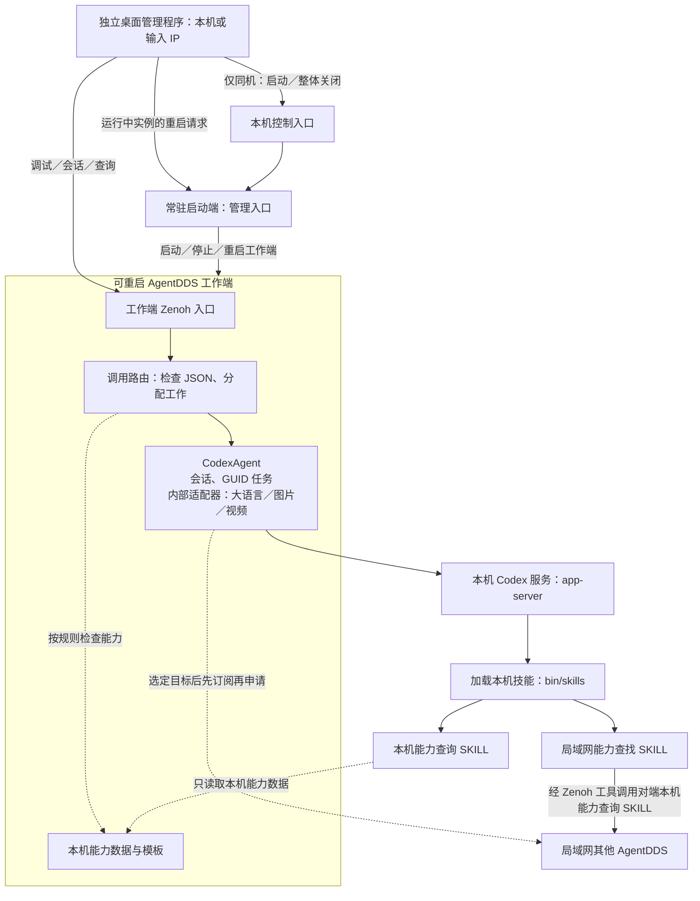
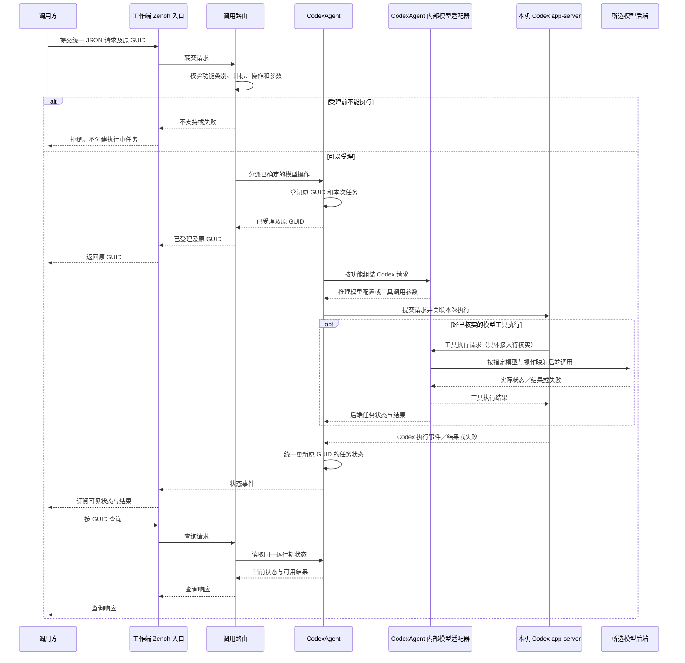

# AgentDDS 技术方案设计文档

> 状态：修订草案，待逐模块审阅；本轮整理为短句、清单和必要表格，不改变已确认行为。
>
> 产品依据：`specs/REQ-001-产品需求文档.md`。技术方案和产品修订稿均待复核；本文不表示功能已经实现或测试通过。

## 1. 软件需求与技术约束

这里的“受理”指目标确认接下任务，不代表任务已经成功。

- **产品边界**：AgentDDS 是设备程序使用的后台服务，不开发设备业务。同机只提供一个实例，桌面程序独立运行。
- **本机启停**：启动和关闭只在本机操作。关闭时两端退出，普通与管理入口都关闭，桌面程序仍可运行。
- **本机／远程重启**：只重启正在运行的工作端，保留启动端。远程不能借重启启动已停止的实例；收到重启请求不等于重启成功。
- **当前对话**：Codex 保持 Agent／大语言模型上下文，CodexAgent 只管理对应关系。调用方不必逐轮重发完整历史，长期记录由调用方保存。
- **会话清理**：主动结束立即清理；观察到存活标记消失后等待一分钟，期间恢复则保留，否则关闭会话和子任务。不要求调用方定时发送心跳消息。
- **模型任务**：三类模型都用请求方的 GUID，先确认受理，再订阅或查询状态与结果。状态分为已受理、处理中、成功、失败；图片和视频不建立聊天会话。
- **重启失效**：旧会话和旧任务不再有效，不恢复记录、不自动重发。
- **自动查找**：指定目标优先；开关默认关闭，只能本地改。开启后，仅在未指定目标或指定目标受理前失败时自动查找。命中后先订阅再申请；受理后失败不改选、不重做。
- **公开能力**：每项对外功能有独立 SKILL 和参数模板。“本机能力查询”和“局域网能力查找”是两个技能，只公布实际支持的能力。
- **访问范围**：第一版局域网普通调用和远程管理均无认证授权，包括远程重启；远程不开放启动、关闭或本机开关修改。
- **通信与容量**：支持多个 Zenoh 中转站，不承诺故障自动切换。并发、超时、结果保留时间和容量上限尚未确定。

## 2. 技术选择与资源位置

**技术选择：**

| 项目 | 已确定内容 | 仍需确认或验证 |
| --- | --- | --- |
| 语言与系统 | Rust；Linux、Windows、macOS | 工具链版本 |
| 桌面程序 | 独立、非网页；默认本机，可输入远端 IP | GUI 工具包、默认安装目录和打包方式 |
| Codex | 源码作为 Git submodule，经本机 app-server 接入；不固定内部 subagent 数量和调度 | 固定提交、构建方式及该版本的具体接口 |
| Zenoh | 传输 JSON 请求、响应和状态；外部 JSON 不直接照搬 Codex 或模型后端协议 | 客户端版本、按 IP 连接的端点、多中转站配置 |
| 三类模型 | 适配器在 CodexAgent 内部；视频以已核实的 MiniMax H3 兼容操作为目标，不支持时明确反馈 | 实际后端、版本和支持操作 |
| 数据 | Codex 保存当前上下文；CodexAgent 在内存中保存会话对应关系和 GUID 任务状态，不复制完整历史或跨重启恢复 | 实现后验证会话隔离和重启清理 |

**资源位置：**

```text
bin/
  skills/<技能名称>/
    SKILL.md
    template.json
  models/<模型名称>/
    <实际模型文件…>
    template.json
```

- 每个技能、每个模型只用一个 `template.json`，在同一文件中放参数结构、说明和填写示例，不再拆文件。
- Agent 根据需求填写模板后返回参数 JSON；填参完成不等于模型执行成功。
- 模型文件不限定格式；目录或文件存在不代表后端已经可调用。
- Codex 如何发现并加载 `bin/skills`，需按固定版本验证。
- 测试配置取自本地 `test/model_config`，其中可能有凭据，不写入文档、不提交。真实模型验证范围见 §5。

## 3. 软件架构

### 3.1 进程、分层和依赖

启动端管进程，工作端管业务，两者合起来是一个 AgentDDS 实例。桌面程序单独运行。工作端的主链是：**Zenoh 入口 → 调用路由 → CodexAgent → 本机 Codex**。图中箭头表示调用或读取关系。



- **CodexAgent**：统一管理会话对应关系、GUID 任务和三类模型适配器。Codex 保存实际上下文，适配器组装请求并处理后端参数、状态和结果；路由不另开一条绕过 Codex 的模型调用路径。
- **模型接入**：Codex 自身的推理模型配置，与图片、视频等能力的工具参数分开。不能假定换一个 `model` 字段就能调用任意后端；工具接口在固定版本上验证后再定。
- **两项 SKILL**：本机能力查询只读本实例能力；局域网能力查找逐个调用对端的本机能力查询，找到匹配目标就返回，不让对端继续扫描，也不直接执行业务任务。后续订阅和申请由发起端完成。
- **底层工具**：能力数据、模板装载和 Zenoh 对端工具为上述技能提供数据或通信，不是重复的业务入口。任务查询、会话关闭等管理操作按程序规则处理，不需要模型推理。
- **启动端管理**：重启和关闭直接由启动端处理，不经过 Agent。重启保留启动端；本机关闭后两端退出，再次启动由本机程序发起。自动查找开关的持有模块和修改入口尚待确认。

### 3.2 层职责与模块边界

| 所在位置 | 模块 | 负责什么／调用谁 |
| --- | --- | --- |
| 启动端 | 进程控制 | 保证单实例，启动、关闭和重启工作端，报告状态；调用本机进程工具，不执行业务。 |
| 工作端接入层 | Zenoh 入口 | 收发 JSON、状态和存活通知；请求交给路由，存活变化交给 CodexAgent。 |
| 工作端支撑 | 能力数据与模板 | 登记本机技能、已核实的模型操作和模板；供路由检查、技能读取，不汇总其他主机。 |
| 工作端应用层 | 调用路由 | 按 JSON 检查目标、操作和参数，分配给 CodexAgent；自动触发查找前检查本机开关，不直接调用模型或执行技能。 |
| 工作端应用层 | CodexAgent | 管理会话对应关系和 GUID 状态，包含模型适配器与 Codex 通信；选定对端后使用 Zenoh 工具先订阅再申请。 |
| CodexAgent 内部 | 三类模型适配器 | 按功能组装 Codex 请求，转换实际后端参数、状态和结果；不支持的操作明确失败。 |
| 本机 Codex | 执行服务 | 保持当前上下文、加载技能、执行请求；结束会话时清理记录，具体停止与删除行为需验证。 |
| 本机 Codex | 本机能力查询 SKILL | 承接原能力总结职责，返回本实例模型、类型、已核实操作、技能说明和模板；读取本机能力数据。 |
| 本机 Codex | 局域网能力查找 SKILL | 使用 Zenoh 工具请求对端的本机能力查询，返回匹配目标；不保存全局目录，不执行业务任务。 |
| 独立桌面程序 | 管理客户端 | 调试模型和技能、查看及结束会话；本机可启停，远端只能重启运行中实例。本机进程控制不走远程接口。 |

### 3.3 运行流程与错误处理

**调用顺序：**

1. 本机程序启动启动端，再启动工作端，加载 Codex、模型配置和技能；准备好后发布就绪。
2. 能力查询请求经路由和 CodexAgent 进入对应 SKILL；本机查询只返回本实例已核实能力。
3. 业务调用优先使用指定目标；需要自动查找时按 §1 的条件执行，命中后先订阅状态再申请。
4. 对于模型调用，CodexAgent 按请求方原 GUID 登记任务、确认受理，再让内部适配器组装 Codex 请求执行。
5. 根据实际执行和后端结果更新状态；订阅与查询读取同一份状态。

**失败与限制：**

- 未准备好不报就绪；Codex 上次异常退出的残留记录需清理，具体方式待验证。
- 不把文件存在或 Agent 推测当成能力可用；不以 Agent 的文字回答代替模型结果，不猜测进度百分比。
- 没有匹配目标就失败，对端不继续代为查找；任务受理后失败不换目标、不重做。
- 对话按请求方隔离。关闭、重启按 §4.2 处理；重启后旧会话、旧任务失效，重新就绪后桌面才恢复连接。
- 目标、后端或中转站导致失败时如实反馈；对端重启使旧请求失效，发起端向上层报失败，不代为恢复。

下图说明本机模型任务。工具怎样接入 Codex 尚待验证，不在此固定具体协议。



## 4. 模块架构与接口概览

逐模块确认。目前只保留启动端正文，其他部分仅留标题。名称和说明仍是草案，没有对应实现代码。

### 4.1 模块组织

### 4.2 启动端

#### 4.2.1 功能

管理工作端的启动、关闭、重启和状态，不处理 Agent、模型或技能任务。

- 用单例锁防止同机重复启动 AgentDDS。
- 本机“关闭”使工作端和启动端都退出，桌面程序不退出。
- “重启”只换工作端，保留启动端；远程不能用重启启动已停止的工作端。
- 自动查找开关、对话和任务管理不放在这里。

#### 4.2.2 实现方式

**启动顺序：**

```text
桌面程序在本机运行启动端
    → init() 初始化
    → start() 启动工作端
    → 收到工作端就绪消息
    → onReady() 通知调用方可以使用
```

- 桌面从默认安装位置运行启动端，不向一个尚未运行的程序发消息让它启动自己。
- `start()` 只负责启动工作端，不负责判断请求来自哪里。

**控制入口：**

- 本机、远程操作由入口区分，不靠方法名或 JSON 自报的来源。
- 远程 Zenoh 管理入口只提供重启和状态查询，没有启动、关闭接口。
- 本机桌面通过仅本机可用的控制通道调用 `stop()`，具体通信方式待定。
- 本机和远程重启都调用 `restart()`。

**关闭与重启：**

- 启动端持有工作端进程句柄。停止前请求工作端清理会话和子任务，再等待退出；丢弃句柄不算关闭。各系统的进程操作分别实现。
- 重启先将 `state` 设为“重启中”，请求旧进程退出；`onExit()` 再调用 `start()`。**`restart()` 不能调用 `stop()`，后者会连启动端一起退出。**
- 本机关闭先将 `state` 设为“关闭中”；工作端退出后，关闭管理连接、释放锁并退出启动端。
- 桌面观察本机进程退出确认关闭完成，不等已退出的程序再回复成功。

#### 4.2.3 属性

| 名称 | 保存什么 | 何时修改 |
| --- | --- | --- |
| `exePath` | 工作端程序文件的完整路径 | 启动时读取本机配置，远程不能改 |
| `handle` | 工作端进程句柄，用于检查、等待或结束进程 | 启动时保存，退出后清空 |
| `state` | 已停止、启动中、可用、关闭中、重启中或失败 | 根据操作和进程事件更新，外部只读 |
| `startId` | 本次启动编号，用来识别重启前的旧消息 | 每次 `start()` 换新编号，只存内存；不是任务 GUID，不恢复旧任务，格式待定 |
| `lastError` | 最近一次启动、关闭或重启失败的原因，无错误时为空 | 出错时更新，不放聊天内容或密钥 |
| `lock` | 防止另一个进程在同机再启动一份 AgentDDS 的单例锁 | `init()` 取得，启动端退出时释放 |
| `connection` | 启动端自己的 Zenoh 管理连接 | `init()` 建立，重启工作端时保留，退出启动端时关闭 |

#### 4.2.4 方法

| 方法 | 做什么 | 结果 |
| --- | --- | --- |
| `init()` | 读启动配置，取得单例锁，建立管理连接 | 成功或失败；锁已占用则不启动第二份 |
| `start()` | 按 `exePath` 启动工作端，保存 `handle`，更新 `startId`，设为“启动中” | 失败记录错误；成功仍需等 `onReady()`，不能提前接任务 |
| `stop()` | 先设为“关闭中”，请求工作端清理并退出，再关闭连接、释放锁、退出启动端；工作端已退出则直接清理并退出 | 先确认收到请求或反馈失败；桌面观察本机进程退出确认完成 |
| `restart()` | 工作端运行时先设为“重启中”，再请求退出；由 `onExit()` 重新启动，启动端不退出 | 先确认请求，再用就绪通知或状态查询确认结果；远程对已停止工作端的重启请求被拒绝 |
| `status()` | 读取 `state`、`startId`、`lastError`，供桌面显示 | 只返回当前状态，不触发启动／重启，不查聊天或任务历史 |

启动端退出后无法查询状态，桌面显示未连接。

#### 4.2.5 消息、响应与回调

**控制消息：**

| 消息 | 入口 | 方法 | 响应 |
| --- | --- | --- | --- |
| 关闭请求 | 仅本机控制通道 | `stop()` | 确认收到或反馈失败；整个程序退出后不再回复 |
| 重启请求 | 本机或远程管理连接 | `restart()` | 确认收到或反馈失败；完成后发就绪通知，失败则报告错误状态 |
| 状态查询 | 本机或远程管理连接 | `status()` | 当前状态、启动编号和错误信息 |

没有远程启动消息；桌面运行启动端是本机进程操作。

**回调：**`onReady`、`onExit` 是收到消息或检测到事件后执行的函数，不是消息本身。

| 回调 | 触发条件 | 处理 |
| --- | --- | --- |
| `onReady()` | 收到就绪消息，启动编号等于当前 `startId`，且 `state` 仍是“启动中” | 设为“可用”并发送就绪通知；旧进程消息及关闭／重启开始后迟到的就绪消息均忽略 |
| `onExit()` | 检测到当前工作端进程退出，不依赖进程主动发消息 | 清空 `handle`；重启中则调用 `start()`，关闭中则退出启动端，意外退出则设为“失败”并记录原因 |

**主动通知：**

- 就绪通知带当前 `startId`，表示可以接任务，订阅方据此识别重启并放弃旧会话、旧任务。
- 状态变化通知说明正在关闭、重启或失败，失败时带原因。收到重启请求不等于重启成功。

具体 JSON 字段、单例锁、本机通信方式和进程不退出时的处理，后续再定。

### 4.3 接入层／Zenoh 与对端调用端口

### 4.4 本机能力查询 SKILL 与模板资源

### 4.5 局域网能力查找 SKILL

### 4.6 应用层／调用路由

### 4.7 应用层／CodexAgent 统一执行管理

### 4.8 内部适配组件与本机运行时

## 5. 开发与验证安排（方案级）

以下是待执行的检查清单，不是已通过的测试结果。

- **Codex 接入**：固定 Rust、Zenoh、Codex 提交和协议版本；验证技能加载、模型请求与工具参数分离、实际工具调用，以及 Codex 会话停止和残留记录清理。
- **进程与桌面**：验证单实例、桌面独立运行和默认目录启动；本机关闭两端退出且入口关闭；远程重启只换工作端，不能启动或重启已停止实例，未就绪不报成功。
- **模板与技能**：每个模型／技能只有一个 `template.json`，含结构、说明和示例；填参检查缺失或错误，不覆盖原模板，不把填参当成执行成功。两项 SKILL 各有独立 `SKILL.md` 和模板，本机查询不混入远端能力。
- **查找与联动**：验证默认关闭、仅本地改、指定目标优先和受理前触发条件；对端不递归扫描，命中后先订阅再申请，失败不重做。另测按 IP 连接和多中转站。
- **会话与任务**：验证请求方上下文隔离、主动结束、一分钟失活宽限、关闭一段会话不影响其他会话、媒体无聊天会话；确认原 GUID，状态来自真实执行，订阅与查询一致。
- **重启后处理**：旧会话、旧任务失效，新旧就绪通知可区分，桌面恢复连接；失败不误报成功，不恢复或重发旧业务。
- **真实模型调用**：大语言、图片做真实调用；视频先模拟后端、核对请求和响应，真实调用留待后续，不标为已实测。

实现测试时，每条 MUST 级要求对应带 `2119: <REQ-ID>` 注释的测试，并在新上下文中独立评审。模型、桌面和跨主机集成测试目前均未执行。

### 5.1 待确认或待核实的细节

| 项目 | 还需要确定什么 |
| --- | --- |
| 桌面与安装 | GUI 工具包、各平台默认安装目录、打包方式。 |
| 启动端 | 单例锁、进程管理、本机通信、停止超时和强制退出策略；§4.2 的属性与方法仍待逐项审阅。 |
| 自动查找配置 | 哪个模块持有开关、怎样从本机修改、是否落盘、重启后怎样处理；默认关闭和只能本地修改不变。 |
| Zenoh 接入 | IP 对应的连接端点、发现方式、多中转站配置及故障处理。 |
| JSON 标准 | 消息字段、版本、错误码和参数检查；JSON-RPC 2.0、JSON Schema 仍是候选，不因此增加模板文件。 |
| Codex 与权限 | 固定提交上的技能发现、文件／命令执行范围、Codex 会话记录删除及残留清理。无调用方授权不代表放开任意主机命令。 |
| 模型工具与媒体 | Codex 工具接口、实际后端版本和操作、H3 兼容范围、媒体输入与结果传递方式；不能假定任意后端受原生支持。 |
| GUID 与容量 | 本次运行期间 GUID 重复怎么处理、结果保留多久、容量上限；不做跨重启恢复。 |
| 无授权访问 | 已确定第一版不做认证授权。部署说明需提示：可连接方也能重启运行中的工作端。 |

### 5.2 与产品需求的对照

第 4 章尚未讨论的条目保持空白；这里只核对已记录的范围，不表示模块设计已完成。

| 产品要求 | 技术文档位置 | 当前状态 |
| --- | --- | --- |
| 后台、桌面、启停与远程重启 | §1–3、§4.2、§5 | 启动端草案待审阅，具体实现未验证 |
| Agent、当前对话与失活清理 | §1–3、§5 | Codex 接入和清理未实测 |
| 两项独立查询 SKILL、模板与模型目录 | §1–3、§5 | 约定保留，相关模块正文待逐项讨论 |
| 指定目标、自动查找、失败不重做 | §1、§3、§5 | 真实多主机调用和订阅顺序未验证 |
| 三类模型、GUID、状态及重启失效 | §1–3、§5 | 协议、工具接入和 GUID 细节待确定 |
| 大语言／图片实测，视频暂不实测 | §2、§5 | 实际模型调用均未执行 |
